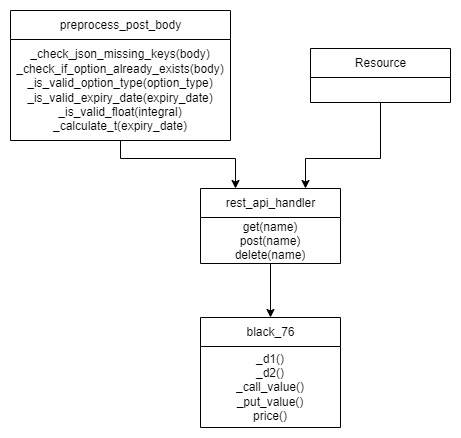

# Rest API application for Option pricing using the Black-76 Formula

A RestAPI web application which:
1. Stores options market data in a local database using PUT requests
2. Calculate the present value on options using Black-76 formula
3. Handle GET requests to retrieve uploaded market data as well as the calculated present value
4. Hadnle DELETE requests to delete options from local database


# Black (1976) Model 

The Black (1976) model is used to evaluate the present value of options and can be used for European options on commodities, future contract as well as bonds. 

The model aims to give an approximation to the current present value of an option given that it relies on a number of assumptions, including:
1. Transaction and profit taxes are ignored
2. The risk free interest rate and volatility are known throughout the life of the option
3. Future prices are log-normally distributed

The Black (1976) models states that the price for an option can be derived as follows:

$$ \text{Call Option Price} = e^{-r.t} \[ \text{fN(d} _{1} )- \text{xN(d} _{2}) \]$$

$$ \text{Put Option Price} = e^{-r.t} \[ \text{xN(-d} _{2} )- \text{fN(-d} _{1}) \]$$

Where:

$$ \text{d} _{1} =  \frac{  \text{ln(f/x) + (v}^2 \text{/2) . t}    } {v\sqrt{t}}   $$

$$ \text{d} _{2} =  \text{d} _{1} - v\sqrt{t}   $$


f = Future option price

x = Strike price at which option will be executed in the future

t = Maturity period (in years), that is, years left until option expires

r = Continuously compounded risk free interest rate

v = Implied volatility for the underlying forward price

N(.) = normal cumulative distribution function

# Environment Setup and Libraries Used
The solution is built in Python and the web framework which handles the RestAPI web application is developed using Flask.

A Python IDE is required to host the application together with the following Python and library versions:

Python == 3.6.5

flask == 2.0.3

json == 2.0.9

numpy == 1.19.5

scipy == 1.5.4


A `requirements.txt` file has been added to this repository which installs the libraries required to run the application.

Run the following command in your Python IDE console to install the required libraries 

```
pip install -r requirements.txt
```

# Code Architecture

The application was delivered using object oriented programming to ensure code modularity and re-usability. 

Figure 1 shows the 4 classes used in the application. Note that class inheritance is adapted, to allow methods and properties to be inherited.  

<p align="center" width="100%">
    
</p>

<p align="center" width="100%">
    Figure 1. Application class diagram

</p>

Flask RESTful provides a `Resource` base class that handles the routing of HTTP requests and methods. This class is inherited by the `rest_api_handler` class which captures the following HTTP Methods:

1. POST requests - The function `post(name)` parses the option name from the URI, performs validity checks on the option market data and populates the option in the local database
2. GET requests - The function `get(name)` parses the option name from the URI, and returns the PV of the option together with the stored market data 
3. DELETE requests - The function `get(name)` parses the option name from the URI, and deletes the option (if present) from the local database

The `preprocess_post_body` class contains functions which validate the content of the POST request.

The `black_76` class inherits from the `preprocess_post_body` as well as the `rest_api_handler` class and calculates the present value of the option using the Black (1976) model. 

