# Table of Contents

1. [Black (1976) Model](#black)
2. [Code Architecture](#architecture)
3. [Flask RestAPI](#flask)
4. [Launching the Flask Application](#launch)
5. [Communication Protocol](#communication)
6. [Deploying to Production](#production)
7. [Error Handling](#error)

# Rest API Application for Option Pricing using the Black-76 Formula

A RestAPI web application which:
1. Stores options market data in a local database using POST requests
2. Calculates the present value of options using Black-76 formula
3. Handles GET requests to retrieve uploaded market data as well as the calculated present value
4. Handles DELETE requests to delete options from local database


# Black (1976) Model <a name="black"></a>

The Black (1976) model is used to evaluate the present value of options and can be used for European options pricing on commodities, future contract as well as bonds. 

The model aims to give an approximation to the current present value of an option given that it relies on a number of assumptions, including:
1. Transaction and profit taxes are ignored
2. The risk free interest rate and volatility are known throughout the life of the option
3. Future prices are log-normally distributed

The Black (1976) models states that the price for an option can be derived as follows:

$$ \text{Call Option Price} = e^{-r.t} \[ \text{fN(d} _{1} )- \text{xN(d} _{2}) \]$$

$$ \text{Put Option Price} = e^{-r.t} \[ \text{xN(-d} _{2} )- \text{fN(-d} _{1}) \]$$

Where:

$$ \text{d} _{1} =  \frac{  \text{ln(f/x) + (v}^2 \text{/2) . t}    } {v\sqrt{t}}   $$

$$ \text{d} _{2} =  \text{d} _{1} - v\sqrt{t}   $$


f = Future option price

x = Strike price at which option will be executed in the future

t = Maturity period (in years), that is, years left until option expires

r = Continuously compounded risk free interest rate

v = Implied volatility for the underlying forward price

N(.) = normal cumulative distribution function

# Environment Setup and Libraries Used
The solution is built in Python and the web framework which handles the RestAPI web application is developed using Flask.

A Python IDE is required to host the application together using the following Python and library versions:

Python == 3.6.5

flask == 2.0.3

json == 2.0.9

numpy == 1.19.5

scipy == 1.5.4


A `requirements.txt` file has been added to this repository which installs the libraries required to run the application.

Run the following command in your Python IDE console to install the required libraries 

```
pip install -r requirements.txt
```

# Code Architecture <a name="architecture"></a>

The application was delivered using object oriented programming to ensure code modularity and re-usability. 

Figure 1 shows the 4 classes used in the application. Note that class inheritance is adapted, to allow methods and properties to be inherited.  

<p align="center" width="100%">
    
</p>

<p align="center" width="100%">
    Figure 1. Application class diagram

</p>

Flask RESTful provides a `Resource` base class that handles the routing of HTTP requests and methods. This class is inherited by the `rest_api_handler` class which captures the following HTTP Methods:

1. POST requests - The function `post(name)` parses the option name from the URI, performs validity checks on the option market data and populates the option in the local database
2. GET requests - The function `get(name)` parses the option name from the URI, and returns the PV of the option together with the stored market data 
3. DELETE requests - The function `get(name)` parses the option name from the URI, and deletes the option (if present) from the local database

The `preprocess_post_body` class contains functions which validate the content of the POST request and is also inherited by the `rest_api_handler` class.

The `black_76` class inherits from the `rest_api_handler` class and calculates the present value of the option using the Black (1976) model. The call and put options present value is calculated within the `_call_value` and `_put_value` functions as shown below.

```
def _call_value(self):
    '''
    Function which returns the present value of the call option

    '''
    return round( np.exp(-self.r*self.t) * (self.f*norm.cdf(self._d1())-self.x*norm.cdf(self._d2())) ,2)

def _put_value(self):
    '''
    Function which returns the present value of the put option

    '''
    return round( np.exp(-self.r*self.t) * (self.x*norm.cdf(-self._d2())-self.f*norm.cdf(-self._d1())) ,2)
```
# Flask RestAPI <a name="flask"></a>

The main entry point for the Rest API application in Flask is initialised as follows:

```
#define Flask server
app = Flask(__name__)
#define API
api = Api(app)
```

A resource is added to the API and the  child `black_76` class is passed to the resource. 
```
#Route Option names to class 'black_75'
#Add resource to Flask API
api.add_resource(black_76,'/<string:name>')
```
Flask routes any URLs to the defined API resource which match the following paths:

```
http://{host_ip}:{port}/<string:name>
```

where 

host_ip = IP on which Flask application is hosted

port = port handling URI requests

name = option name 

The Flask server also route home directory requests, that is, `http://{host_ip}:{port}` access requests to a home page which displays all stored options and market data within the local database using the `route` method shown below.

```
@app.route("/")
def index():
    return jsonify({'Local Database': Data})
```

# Launching the Flask Application <a name="launch"></a>

The flask application can be started by executing the following command in the directory containing this repository. 

```
python app.py
```

The Flask server returns the path on which the server is running as shown in Figure 2:

<p align="center" width="100%">
    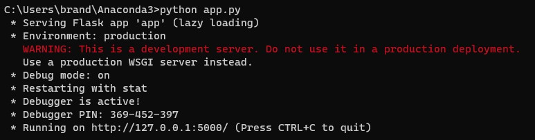
</p>

<p align="center" width="100%">
    Figure 2. Hosted Flask Application

</p>


# Communication Protocol <a name="communication"></a>

This demonstration is carried out using Postman to send POST, GET and DELETE requests to the Flask Application. 

## Option Name

The RestAPI allows the user to use any naming convension to unique identify an option. 

The following option name standard is used by the author: AA-MMMYY-{C/P}-1111

where:

AA - represents the product name e.g. BB for Brent Cruid Oil Futures

MMMYY - represents the Contract Month e.g. JAN24

{C/P} - can take a value of 'C' or 'P' depending on whether the option is a call of put

1111 - can be any integer value representing the strike price e.g. 100

An example of a name can be: BB-JAN24-C-100 (Brent Cruid Oil Futures, with a contract month
    of January 2024, being a call, with a strike price of $100


## Sending POST Requests
POST requests can be invoked by sending a POST message to the server. Using the Flask server link `http://127.0.0.1:5000/` shown in Figure 2, a POST request is sent by specifying the following URL:

```
http://127.0.0.1:5000/BB-NOV22-P-2100
```

Where BB-NOV22-P-2100 is the option name (Brent Cruid Oil Future, contract month November 2022, Put Option, and Strike value of $2100)

Market data for the option is sent in the form of a JSON message within the POST request as follows:

```
{
  "type":"p",
  "f":2006,
  "x":2100,
  "expiry":"2023-01-05",
  "r": 0.051342,
  "v":0.35
}
```
The market data shows that the option type is a **put**, with the future option price of $2006, strike price of $2100, expiry of 2023-01-05 (yyyy-mm-dd format), risk free return of 5.13% and an implied volatility of 35%. 

Note that the API expects the following in the JSON body:

"type": option type as a single character 'c' or 'p' defining the if the option is a call or put

"f": future option price as a continuous positive variable

"x": strike price as a continuous positive variable

"expiry": option expiry date in the string format yyyy-mm-dd


"r": risk free rate as a continuous positive variable

"v": volatility as a continuous positive variable


If all the required market parameters are met within the JSON body, the parameters are in the expected type, and the option name specified in the URL is not already stored in the local database, the API will respond with the following message:

```
{
    "message": "Added BB-JAN22-P-100 successfully"
}
```

<p align="center" width="100%">
    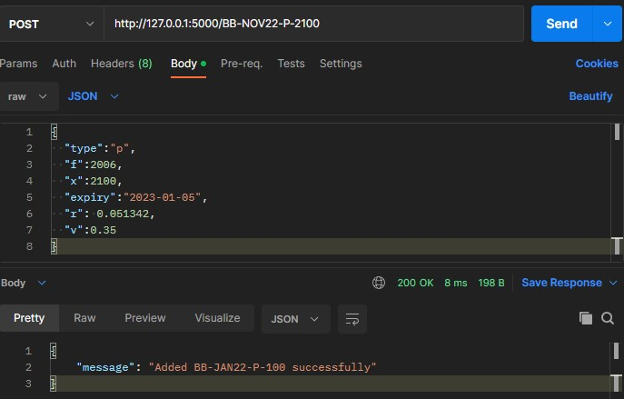
</p>

<p align="center" width="100%">
    Figure 3. A POST request for BB-JAN22-P-100 option

</p>

The API calculates the present value based on the market data provided and stores all data within a local database. 

## Sending GET Requests
GET requests can be invoked by sending a GET message to the server. Using the Flask server link `http://127.0.0.1:5000/` shown in Figure 2, a GET request is sent by specifying the following URL:

```
http://127.0.0.1:5000/BB-NOV22-P-2100
```

Where BB-NOV22-P-2100 is the option name (Brent Cruid Oil Future, contract month November 2022, Put Option, and Strike value of $2100)

If the option is found in the local database, a JSON message containing the `pv` that is the present value calculated using the Black (1976) model as well as the stored market data are returned as shown in Figure 4.

<p align="center" width="100%">
    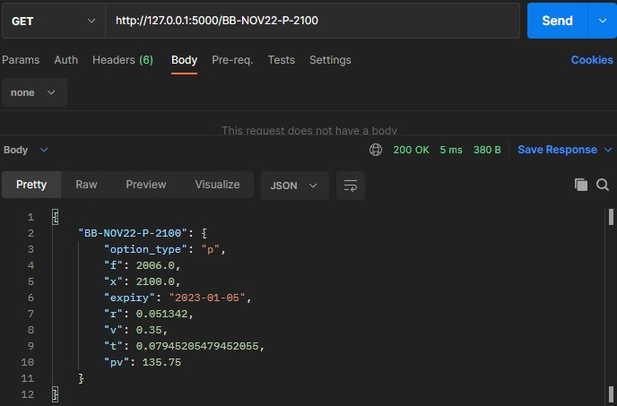
</p>

<p align="center" width="100%">
    Figure 4. A GET request for BB-JAN22-P-100 option

</p>

Submitting GET requests for options which are not stored in the local database will return a warning message as shown in Figure 5.


<p align="center" width="100%">
    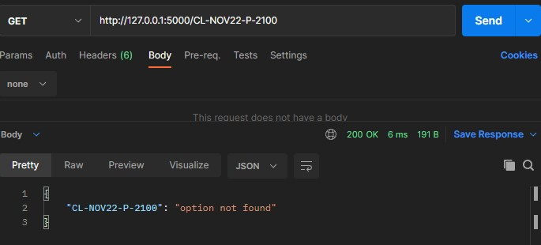
</p>

<p align="center" width="100%">
    Figure 5. A GET request for CL-NOV22-P-2100 option which is not stored in the local database

</p>

## Accessing the Root Directory

The root directory can be access using the Flask server link `http://127.0.0.1:5000/` shown in Figure 2. The Flask server returns a JSON message of all options stored in the local database, together with the market data as well as the present value calculated using the Black (1976) model as shown in Figure 6.


<p align="center" width="100%">
    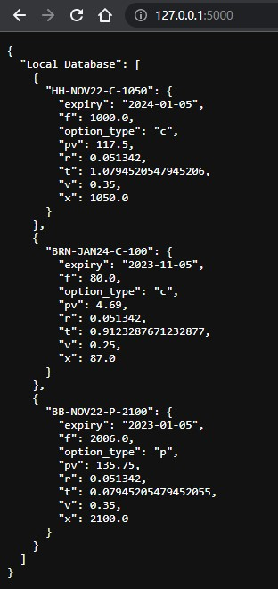
</p>

<p align="center" width="100%">
    Figure 6. The Flask application returns the options stored in the local database when access the root directory.

</p>

## Sending DELETE Requests
DELETE requests can be invoked by sending a DELETE message to the server. Using the Flask server link `http://127.0.0.1:5000/` shown in Figure 2, a DELETE request is sent by specifying the following URL:

```
http://127.0.0.1:5000/BRN-JAN24-C-100
```

Where BB-NOV22-P-2100 is the option name 

If the option is found in the local database, a JSON message confirming that the option has been deleted will be returned as shown in Figure 7.

<p align="center" width="100%">
    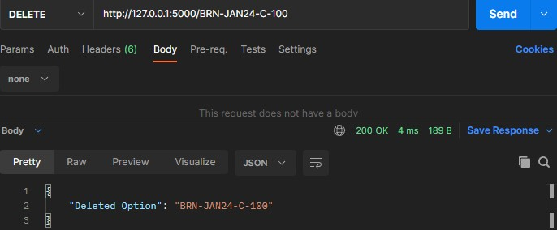
</p>

<p align="center" width="100%">
    Figure 7. A DELETE request for BB-NOV22-P-2100 option

</p>

If the option to be deleted is not found in the local database, a message similar to Figure 5 will be returned, stating that option was not found.


# Deploying to Production <a name="production"></a>

For this demonstration, the application has been hosted on a local hosted server. The local server was run on `http://127.0.0.1:5000/`.

The RestAPI can be deployed to production. 

This can be achieved by either option for:

1. Self Hosted Server

Using a WSGI application, a self managed and self hosted server can be hosted to run the application. The server would return a URL which can be replaced by the `http://127.0.0.1:5000/` used throughout this document. The authentication in the form of API keys can be used to securely send requests to the API. 

2. Cloud Platform

A more secure, less maintainable and more reliable method is to host the API on a fully managed web hosting cloud platform such as [Azure App Service](https://learn.microsoft.com/en-us/azure/app-service/quickstart-python?tabs=flask%2Cwindows%2Cazure-cli%2Cvscode-deploy%2Cdeploy-instructions-azportal%2Cterminal-bash%2Cdeploy-instructions-zip-azcli) or [AWS Elastic Beanstalk](https://docs.aws.amazon.com/elasticbeanstalk/latest/dg/create-deploy-python-flask.html)

Both platforms offer the use of integrated load balancers, alarm triggering, and enhanced security.

# Error Handling <a name="error"></a>

The Rest application invokes a 404 error handler whenever an exception is raised and returns the error message as JSON to the requester.

### Option already exists

If a POST request is submitted and the option name already exists in the local database, the message shown in Figure 8 will be returned. 

<p align="center" width="100%">
    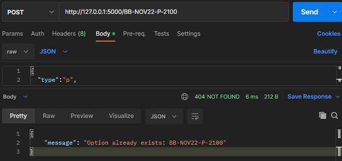
</p>

<p align="center" width="100%">
    Figure 8. A POST request for an option which already exists in the local database

</p>


### Missing Key 

If a POST request is submitted and any key to calculate the PV is missing in the JSON body, the message shown in Figure 9 will be returned. 

<p align="center" width="100%">
    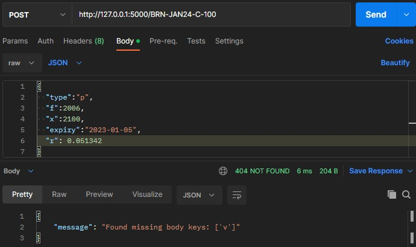
</p>

<p align="center" width="100%">
    Figure 9. A POST request for an option with the missing volatility rate

</p>


### Incorrect Option Type

If a POST request is submitted and the option type is not 'p' or 'c', the message shown in Figure 10 will be returned. 

<p align="center" width="100%">
    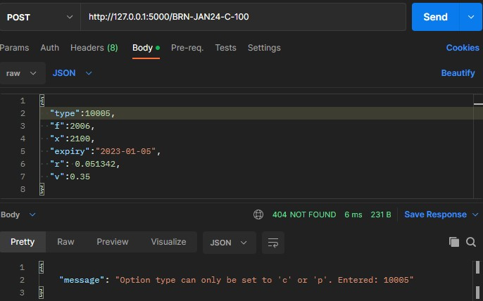
</p>

<p align="center" width="100%">
    Figure 10. A POST request for an option with a type not 'p' or 'c'

</p>


### Negative Value for the Continuous Market Data Variables

If a POST request is submitted and any of the continuous variables have a negative value (or has a string/symbol), the message shown in Figure 11 will be returned. 

<p align="center" width="100%">
    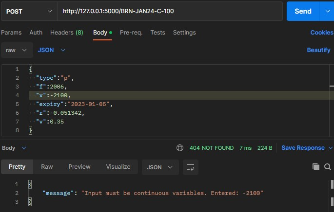
</p>

<p align="center" width="100%">
    Figure 11. A POST request  for an option with a negative continuous variable 

</p>

### Incorrect Expiry Date

If a POST request is submitted and the expiry date is not in the yyyy-mm-dd format, the message shown in Figure 12 will be returned. 
<p align="center" width="100%">
    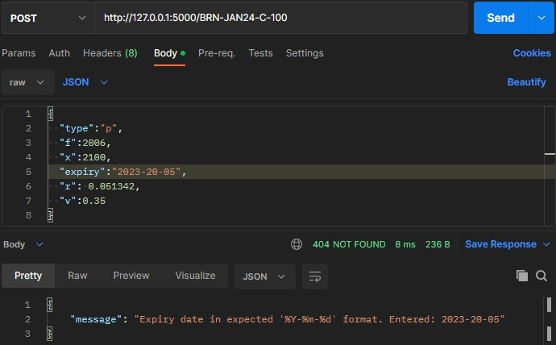
</p>

<p align="center" width="100%">
    Figure 12. A POST request  for an option with incorrect expiry date

</p>

